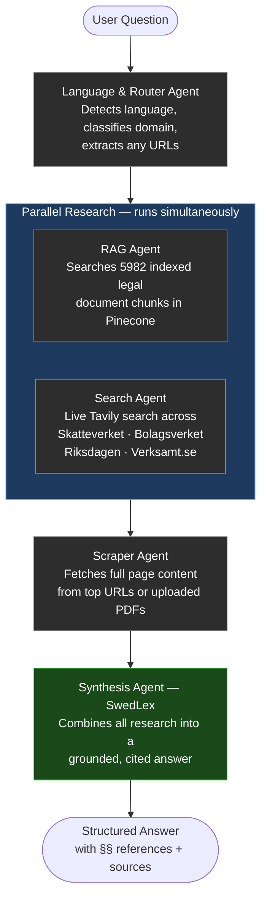

# SwedLex — Swedish Legal Compliance AI Agent

> An AI assistant that answers Swedish corporate law, tax, and labor questions with cited sources — built on Google ADK, Pinecone, and live government data.

---

## What is this?

Running a business in Sweden means navigating a maze of laws — the Companies Act (ABL), Skatteverket tax rules, LAS labor regulations, Bolagsverket registration requirements. Getting it wrong is expensive.

SwedLex is an AI agent that reads the actual legal texts, searches live government sources, and gives you grounded, cited answers — not hallucinated guesses.

---

## How it works (the pipeline)



Every answer goes through four stages:

1. **Router** — figures out what language you're asking in and what domain the question belongs to (tax, corporate law, labor, registration)
2. **Parallel research** — while the RAG agent queries 5,982 pre-indexed chunks from Swedish legal PDFs, the search agent simultaneously fires off a live Tavily search against Skatteverket, Riksdagen, Bolagsverket — both finish before either waits for the other
3. **Scraper** — grabs the full text of the top-ranked pages (or your uploaded PDF document)
4. **Synthesis** — combines everything and writes a structured answer with specific §§ citations, source URLs, and a disclaimer if you should really be talking to a lawyer

---

## What can you ask it?

**Corporate law**
- "What are the requirements for a hembudsförbehåll in a Swedish AB?"
- "Explain förköpsförbehåll vs samtyckesförbehåll"
- "What does ABL 4 kap §27 say about share transfer restrictions?"

**Tax**
- "What VAT rate applies to SaaS sold to a Norwegian B2B customer?"
- "How does Swedish reverse-charge VAT work for digital services to Germany?"
- "When do I need to register for F-skatt?"

**Labor law**
- "How do I calculate karensavdrag for a part-time employee?"
- "What are the minimum notice periods under LAS?"
- "Can I include a non-compete clause in a Swedish employment contract?"

**Website / document compliance**
- Paste any URL: "Does this page comply with Swedish privacy rules? https://example.se"
- Paste a PDF link: "Review this shareholders agreement for compliance issues: https://example.com/avtal.pdf"

---

## What's under the hood

| Component | What it does |
|-----------|-------------|
| **Google ADK 2.2.0** | Agent orchestration framework — SequentialAgent, ParallelAgent, LlmAgent |
| **Gemini 2.5 Flash** | The language model powering all four agents |
| **Pinecone** | Cloud vector database holding 5,982 structured legal document chunks |
| **Sentence Transformers** | `paraphrase-multilingual-MiniLM-L12-v2` — embeds both Swedish and English queries into the same vector space |
| **Tavily** | Search API that returns content from Skatteverket, Riksdagen, Bolagsverket, and other Swedish government sources |
| **Structural RAG** | Documents are split into three typed layers: `law_text` (the actual §§), `reasoning` (why the rule exists), `committee` (legislative debate history) — queries route to the right layer |

---

## The RAG setup

The indexed documents cover:
- **sweden.pdf** — Main Swedish Companies Act (ABL, 893 pages)
- **download.pdf** — Additional Swedish corporate law documents
- **SFS 2026:495** — Latest amendment to ABL Chapter 4 §41

When you ask about hembudsförbehåll, the RAG agent doesn't just do a keyword search. It detects your intent:

- Asking *"what are the requirements?"* → searches `law_text` nodes (exact §§ paragraphs)
- Asking *"why does this rule exist?"* → searches `reasoning` nodes (legislative intent, Skälen för)
- Asking *"how was this debated?"* → searches `committee` nodes (Kommitténs förslag, Remissinstanserna)

This means you get the actual statutory text, not just summaries.

---

## Project structure

```
ADK_Legal/
├── agent.py          ← Root pipeline (SequentialAgent + all sub-agents)
├── __init__.py       ← ADK entry point
├── tools.py          ← Tavily search tool + HTML/PDF scraper tool
├── build_rag.py      ← One-time script to index PDFs into Pinecone
├── rag_agent/
│   ├── agent.py      ← RAG sub-agent (LlmAgent with Pinecone tool)
│   └── rag_tool.py   ← Intent-aware Pinecone retrieval
└── extras/
    └── docs/         ← Source PDFs (sweden.pdf, download.pdf)
```

---

## Running it

```bash
# Install dependencies
python3 -m venv .venv
source .venv/bin/activate
pip install google-adk tavily-python httpx beautifulsoup4 pinecone-client \
            sentence-transformers PyPDF2 python-dotenv

# Set your API keys in .env
GOOGLE_API_KEY=...
TAVILY_API_KEY=...
PINECONE_API_KEY=...

# Build the RAG index (only needed once)
python build_rag.py

# Launch the agent
adk web .
# Open http://localhost:8000 and select ADK_Legal
```

---

## Design decisions worth knowing

**Why parallel research?** The RAG query and web search are completely independent — running them sequentially would add 15-20 seconds of dead wait time per query. Running them together means the total time is `max(rag_time, search_time)` instead of `rag_time + search_time`.

**Why Pinecone over ChromaDB?** Production-ready cloud storage, persistent across sessions, no local disk management. The index survives restarts.

**Why structural RAG instead of naive chunking?** Swedish legal PDFs have a clear three-layer structure — statutory text, legislative reasoning, and committee debate. Chunking naively loses that signal. By tagging each chunk with its document layer type, the retriever can answer "what does the law say" and "why was it written that way" with different source material.

**Why Tavily instead of Google Search?** Google's grounding tool modifies the LLM request internally and can't return structured URLs for pipeline passing. Tavily returns clean JSON with scores, URLs, and page content that downstream agents can act on.

---

## Limitations

- Answers are grounded in indexed documents and live search, but **this is not legal advice**. Always consult a licensed Swedish lawyer (advokat) or certified accountant before making legal or financial decisions.
- The RAG index covers the documents listed above. For very recent SFS amendments (post-2025), the live web search path is more reliable.
- PDF analysis works on direct PDF URLs. Native file upload requires additional frontend integration.
